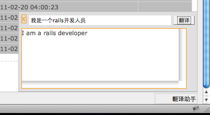

## ActsAsTranslatebox

Add a translate box at the page bottom for your rails project.

Author: [Qichunren](http://cqror.com/qichunren)

### How to use it? 

     gem install acts_as_translatebox
     
In Gemfile
     
     gem "acts_as_translatebox" 

Then just use
      
      acts_as_translatebox
      
in your controller.

#### Example      

        class PostsController < ApplicationController

        	acts_as_translatebox :only => ["index","show"]
  
          def index
          	@posts = Post.latest(5)
          end
  
          def new
          	@post = Post.new
          end
  
          def show
          	@post = Post.find(params[:id])
          end

        end
        

Copyright (c) 2009 [name of plugin creator], released under the MIT license
